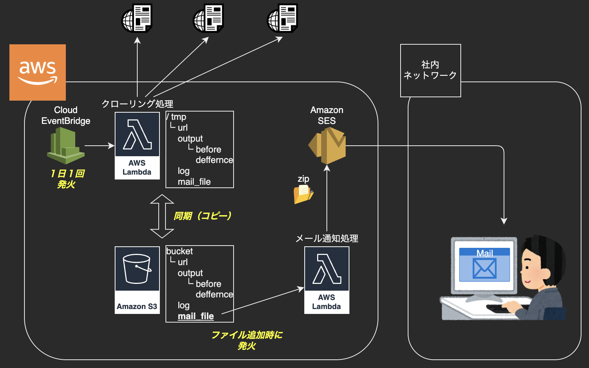
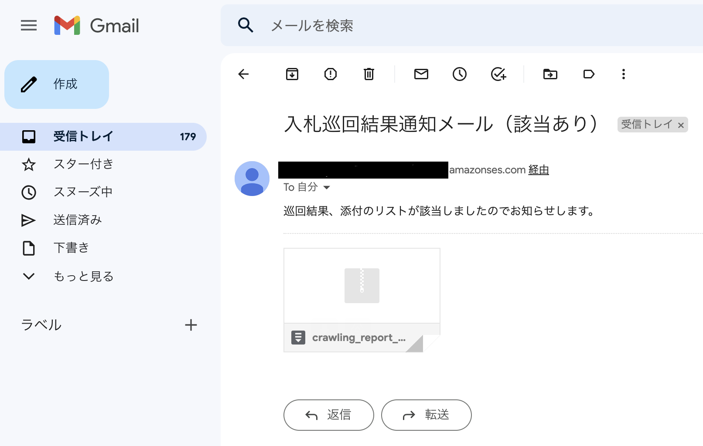
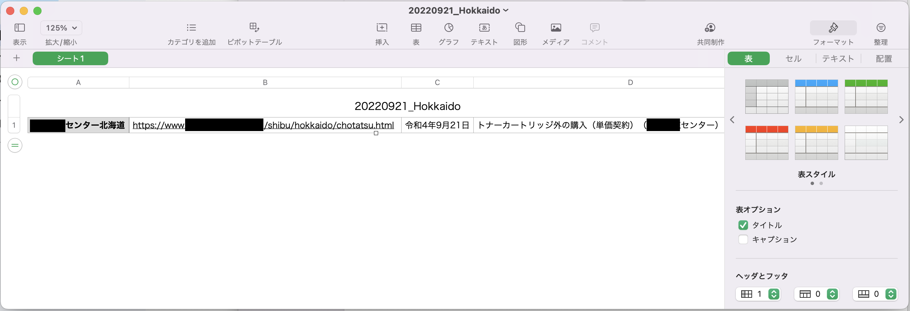
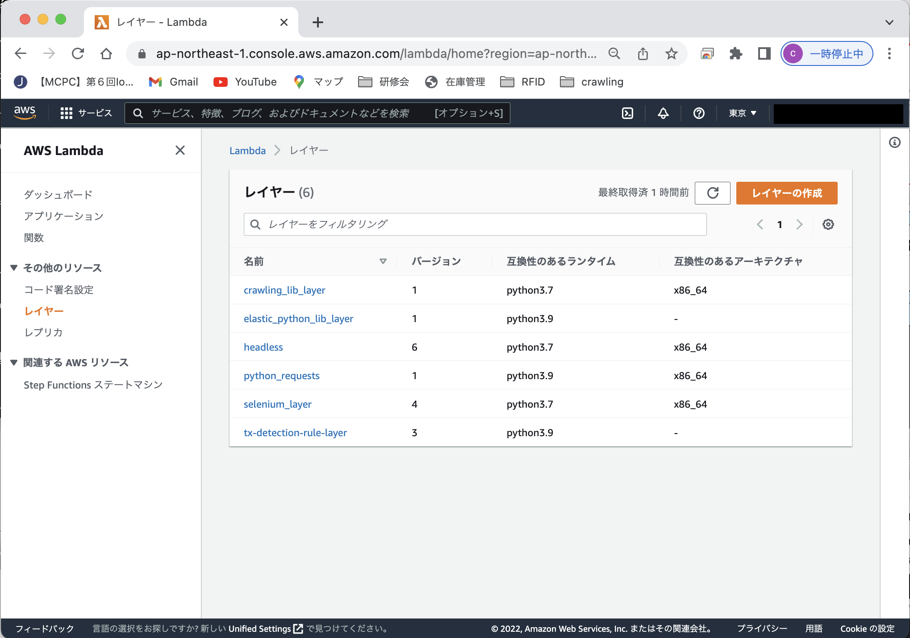
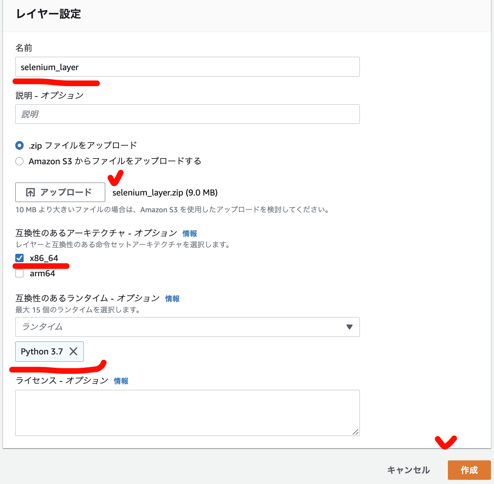

# 案件情報 定期クローリングシステムの構築

本稿では、AWSを使用した案件情報サイトへの定期クローリングと、メール通知システムの実装方法について、説明します。

 

## 全体構成図

本機能の構成概略を、以下に図示します。

 

## 通知メールイメージ

本機能が実行されると、１日に１回、以下のメールが、予め登録している通知先に送られてきます。

 

上記メールに添付されたzipファイルの内容（csv）

 

## 構築の流れ

以下に、本機能の構成手順についてご説明します。  
大まかな流れは、次の通りです。

- [lambdaレイヤの作成と配置](#lambdaレイヤの作成と配置)
- [S3バケットの作成とファイル配置](#s3バケットの作成とファイル配置)
- [「クローリング」lambda関数の作成と配置](#クローリングlambda関数の作成と配置)
- [「通知」lambda関数の作成と配置、Amazon SES設定](#通知lambda関数の作成と配置amazon-ses設定)
- [Amazon EventBridgeのスケジュール設定](#amazon-eventbridgeのスケジュール設定)

 

## 構築手順詳細

 

### lambdaレイヤの作成と配置

 

#### レイヤの作成とは
本稿のPythonコードでは、selenium等の外部ライブラリを使用しますが、これらはAWS lambdaでは標準提供されていないため、そのままコードを実行すると、no module エラーとなります。

lambda環境で外部ライブラリが使用できるようにするには、開発者自身でライブラリを入手してlambda環境に配置する必要があるのです。

この対応は２つあります。
1. ソースコードと、外部ライブラリをまとめて一つのzipに圧縮し、「lambda - 関数」に登録する。

2. ソースコードと、外部ライブラリをそれぞれ別のzipに圧縮する。外部ライブラリは「lambda - レイヤ」に登録する。ソースコードは「lambda - 関数」に登録しつつ、コード側の設定画面で上記レイヤを使用するように指定する。

手順１の方が簡単ですが、複数のlambda間でライブラリの使い回しができません。また、lambdaのコード画面の制約で、5MBを超えるとソースのかくにん・編集ができなくなる、という問題があり、ライブラリを含めてしまうとこれに該当します。

今回は手順２の方法をとることにします。

 

#### 作成するレイヤ
今回のクローリングでは、次のものが必要です。

- pythonライブラリ(lambdaが標準提供してないもの)
  - selenium==4.1
  - requests
  - BeautifulSoup4
  - datetime  

  ※これらは[requirements.txt](./crawlingNyusatuFunc/requirements.txt)に登録しています。

- スクレイピング実行環境
  - chromeブラウザ
  - chromeDriver

 

#### 作成方法

レイヤ作成の大きな流れは、次のとおりです。

1. pythonライブラリをpipするためのDocker環境構築 ※
2. Dockerのamazon linux2上でpipコマンドを実行してライブラリ取得
3. ライブラリをzip圧縮する。
4. スクレイピング実行環境のファイルをダウンロードする。
5. スクレイピング実行環境をzip圧縮する。

<h6>※ この手順のとおり、pipコマンドでpythonの外部ライブラリを取得する環境は、Windowsではなく、OS「amazon linux2」互換環境で行うことをお勧めします。pythonの外部ライブラリには、C言語等のOS依存バイナリが使われている場合があるため、Windows環境でpipしたライブラリでレイヤを作ると、lambda環境にアップしても動かない、ということが起こリます。</h6>

ここでは、Layerの作り方は省略します。

1〜3は、[こちらのサイト](https://www.cloudnotes.tech/entry/Lambda_Layer_windows)などを参考に実行してみてください。zip圧縮する際には「python」という名前のディレクトリ（フォルダ）を作ってその中に入れる必要があるので、注意してください。

4〜5の参考サイトは[こちら](https://zenn.dev/eito_blog/articles/72f7b459e2d591)がおすすめです。ポイントとして、バージョン等が非常に重要で、これ以外の環境でやろうとすると激ハマりします。まずは素直に、参考サイトに従うようにしましょう。

今回、作成したzipファイルは、以下にあります。
- pythonライブラリ  
  [./assets/bin/lambda-layer/selenium_layer.zip](./assets/bin/lambda-layer/selenium_layer.zip)

- スクレイピング実行環境  
  [./assets/bin/lambda-layer/headless.zip](./assets/bin/lambda-layer/headless.zip)

 

#### レイヤの配置

AWSへのレイヤの登録方法を以下に示します。

- AWSコンソールマネジメントにログインする。
- AWSのサービス一覧で、「AWS lambda」を選択する。
- 左側の「レイヤー」を選び、画面右上にある「レイヤーの作成」をクリックする。
- 以下の設定をして、作成ボタンを押す。
  - 名前：任意
  - アップロードボタンを押して作成したzipファイルを選択
  - 互換性のあるアーキテクチャ：x86_64
  - 互換性のあるランタイム：Python3.7
  

上記の手順で、`selenium_layer.zip`と`headless.zip`をそれぞれ登録した、2つのレイヤを作成します。

以上で、「lambdaレイヤの作成と配置」は終了です。

 

### S3バケットの作成とファイル配置

後述のクローリング処理が必要とするファイルを、S3上に配置します。

- AWSコンソールマネジメントにログインする。
- AWSのサービス一覧で、「S3」を選択する。
- 左側の「バケット」を選び、画面右上にある「バケットを作成」をクリックする。
- 任意のバケット名を入れて、右下にある「バケットを作成」をクリックする。
- 作成したバケットを選択して、その中に以下のフォルダを作成する。  
  |フォルダ名|フォルダ概要|for read/write|
  |--|--|--|
  |url|（クローリングするURLの一覧）|r|
  |output|（クローリング実行結果）|r/w|
  | ├ before|（前回の実行結果）|r/w|
  | └ difference|（前回との差分）|r/w|
  |mail_file|（メール通知する内容）|r/w|
  |log|（クローリング実行ログ）|w|

- 「url」フォルダの中に、以下のファイルをアップロードする。
  - クローリング対象のURL一覧csv  
    [/crawlingNyusatuFunc/url/url.csv](/crawlingNyusatuFunc/url/url.csv)

以上で、S3バケットの準備は終了です。

 

### 「クローリング」lambda関数の作成と配置

クローリングを実行するlambda関数を作成します。コードは、以下のパスの内容となります。

- 「クローリング」lambda関数  
  - [/crawlingNyusatuFunc/lambda_function.py](/crawlingNyusatuFunc/lambda_function.py)
  - [/crawlingNyusatuFunc/crawlingBid.py](/crawlingNyusatuFunc/crawlingBid.py)

このコードをAWS lambda関数に登録していきます。   

 

#### ソースコードをzip圧縮

最初に、ローカル環境で、上記2つのファイルを、zipファイルとして圧縮しておいてください。（zip内にフォルダを作らないよう、注意してください）

 

#### lambda関数の新規作成

AWS lambdaにクローリングlambdaを新規作成します。

以下の手順で、lambda関数を新たに構築します。

- AWSコンソールマネジメントにログインする。
- AWSのサービス一覧で、「Lambda」を選択する。
- 左側の「関数」を選び、画面右上にある「関数の作成」をクリックする。
- 「関数の作成」画面で、以下の設定を行なって「関数の作成」ボタンをクリックする。
  - 以下のいずれかのオプションを〜：一から作成
  - 関数名：任意。
  - ランタイム：Python3.7
  - アーキテクチャ：x86_64

しばらくすると、lambda関数が作成され、関数の編集画面に遷移します。最初にzip圧縮したソースコードを、この編集画面にアップロードします。

- 編集画面中頃にあるタブの一覧から、「コード」を選択する。
- 右端の「アップロード元」-「zipファイル」選択する。
- アップロードボタンを押して前述のzipファイルを選択し「保存」ボタンをクリックする。
- 「コード」の画面左側のツリーに、前述の２つの.pyファイルが表示されていれば、アップロード完了。

 

#### lambda関数の設定変更

作成したlambda関数に対して、次の設定を行います。

- lambdaレイヤの設定
- 環境変数の設定
- ロールポリシーのアタッチ

lambda関数編集画面の下部にある「レイヤ」で、アップロードしたレイヤを選択します。

- 「レイヤーの追加」をクリックします。
- 「レイヤーの追加」画面で、「カスタムレイヤー」を選択。
- 「カスタムレイヤー」で、[前の手順](#レイヤの配置) でアップロードしたレイヤを選択。

上記の手順で、`selenium_layer.zip`と`headless.zip`の２つのレイヤを追加します。

 

次に、環境変数を設定します。

- lamdba編集画面で、「設定」タブを選択する
- 左のメニューから「環境変数」を選択する
- 右の「編集」ボタンをクリック
- 「環境変数の編集」画面で、「環境変数の編集」ボタンをクリックして次の２つを登録する。
  |キー|値|
  |--|--|
  |on_lambda|True|
  |s3_bucket|ksap-nyusatu-crawling|

これらの環境変数は、lambda関数の中で参照しています。   

 

<h5>
「on_lambda」環境変数は、実行環境がAWSなのか、オンプレミスなのかを区分するために作っています(キーがあるかどうかで判定しているので、値はなんでも良いです)。これによって、ファイル群を参照するフォルダを読み分けています。</h5>

  |<h5>環境|<h5>フォルダ|
  |--|--|
  |<h5>クラウド|<h5>"/tmp/"|
  |<h5>オンプレミス|<h5>カレントフォルダ "os.getcwd() + '/'"|

最後に、lambdaの実行ロールに、ポリシーをアタッチします。

- lamdba編集画面で、「設定」タブを選択する
- 左のメニューから「アクセス権限」を選択する
- 右の「実行ロール」に表示されている「ロール名」のハイパーリンクをクリックする。
- 新しいタブでIAMサービス画面が開かれるので、「許可ポリシー」の右にある「許可を追加」をクリックして「ポリシーをアタッチ」を選択する。
- 一覧で表示されるポリシーから、「AmazonS3FullAccess」を選択して「ポリシーをアタッチ」ボタンをクリックする。

これにより、lambda関数からS3のファイルを読み込んだり、書き込んだりすることができるようになります。

以上で、「クローリング」lambda関数の作成と配置は終了です。

 

### 「通知」lambda関数の作成と配置、Amazon SES設定

クローリングlambdaが実行されると、S3バケット内の「/mail_send」内にcsvファイルが作られます。  

csvが作られることをトリガーにして、予め決められた配信先にメール通知が行われるよう、S3、lambda、SESの連携を行います。

#### SESで通知設定を行う

「Amazon Simple Email Service」（Amazon SES）を使用して、AWSからEmail通知を行うためのメールアドレス認証を行います。「送信元」の選択では「ドメイン」と「メールアドレス」の２つから選択することができますが、今回は後者を選択し、特定のメールアドレスから送信されたテイにします。

使用するメールアドレスは、送信元、送信先ともに、事前にメールアカウントの所有者が認証を行わないと、通知の際に送信エラーとなってしまいます。最初に、次の手順でメールアドレスの認証を行います。

- AWSコンソールマネジメントにログインする。
- AWSのサービス一覧で「Amazon Simple Email Service」を選択する。
- 左側の「Verified identities」を選び、「Create identity」ボタンをクリックする。
- 「Create identity」画面で、「Identity type」に「Email address」を選択。
- 「Email address」欄に、送信元のメールアドレスを入力して「Create identity」をクリック。

この後、登録したメールアドレスに、以下の通知メールが送られてきます。モザイクされたハイパーリンクをクリックすることで、認証が行われますので、クリックしてください。

上の手順を使用して、***<u>「送信元」と「送信先」、２つのメールアドレスを認証</u>*** してください。

 

#### 「通知」lambda関数の作成と配置

「通知」用のlambda関数を新規に作成します。コードは、以下のパスの内容となります。

- 「通知」lambda関数  
  - [/notifyNyusatuFunc/lambda_function.py](/notifyNyusatuFunc/lambda_function.py)

まずは「クローリング」Lamdbdaと同様に、zipファイルに圧縮してください。

次に、AWS lambdaに関数を登録します。作成方法、zipファイルアップロードの手順は[「クローリング」lambdaの手順](#lambda関数の新規作成)を参考にしてください。

作成したlambda関数に対して、次の設定を行います。

- 環境変数の設定  
  lambda編集画面で「設定」-「環境変数」を開き、以下の環境変数を設定してください。

  |キー|値|
  |--|--|
  |DST_MAIL|`xxxx@gmail.com`（送信元のメールアドレス）|
  |SRC_MAIL|`xxxx@gmail.com`（送信先のメールアドレス）|

- ロールポリシーのアタッチ  
  lambda編集画面で「設定」-「アクセス権限」を開きます。ロールのハイパーリンクから、IAMサービスに遷移して、以下のポリシーをアタッチします。

    - AmazonS3FullAccess 
    - AmazonSESFullAccess

 

#### S3ファイルの更新トリガーを設定する

S3のクローリング結果ファイルの作成に応じてlambdaが起動するように、イベント通知設定を行います。

- AWSコンソールマネジメントにログインする。
- AWSのサービス一覧で「S3」を選択する。
- 左側の「バケット」を選び、[前の手順](#s3バケットの作成とファイル配置)で作成したバケットを検索して、ハイパーリンクをクリックし、バケットの詳細画面を開く。
- バケットの詳細画面で、「プロパティ」タブを選択し、「イベント通知」エリアで「イベント通知を作成」ボタンをクリック。
- 「イベント通知を作成」画面で以下の通り入力して、「変更を保存」ボタンをクリックする。
  - イベント名：任意
  - プレフィックス：mail_file/
  - サフィックス：.csv
  - イベントタイプ：「オブジェクトの作成」-「PUT」だけをチェック
  - 送信先：Lambda関数
  - Lamdba関数：（[前の手順](#通知lambda関数の作成と配置)で作成したlambda関数を指定）

この設定によって、クローリング結果が「mail_file/」フォルダにcsvが配置される都度、新たに配置されたファイルを引数として、「通知」lambda関数が呼び出されるようになります。

以上で、「通知」lambda関数の作成と配置、Amazon SES設定は終了です。

 

### Amazon EventBridgeのスケジュール設定

スケジューラを使用して、１日に１回、クローリングを起動するように設定を行います。

- AWSコンソールマネジメントにログインする。
- AWSのサービス一覧で「Amazon EventBridge」を選択する。
- 左側の「ルール」を選び、「ルールを作成」ボタンをクリックする。
- 「ルールの詳細を定義」画面で次の通り設定して「次へ」をクリックする。
  - 名前：任意
  - ルールタイプ：スケジュール
- 「スケジュールを定義」画面で次の通り設定して「次へ」をクリックする。
  - スケジュールパターン：「特定の時刻〜（略）」を選択する。
  - cron：（実行したい時間をUTC※で設定する）  
    例）日本時間の朝8時に実行したい →  cron(0 23 * * ? *)  
    ※ UTC = 日本時間 - 9時間
- 「ターゲットを選択」画面で次の通り設定して「次へ」をクリックする。
  - ターゲットタイプ：AWSのサービス
  - ターゲットを選択：Lambda関数
  - 機能：（[クローリングlambda関数](#lambda関数の新規作成)の名前）
- 「設定と更新」画面で、「ルールの更新」ボタンをクリックする。

この設定によって、スケジュールで指定した時間になったら、自動的にクローリングlambdaが起動して、クローリングが実行されます。

